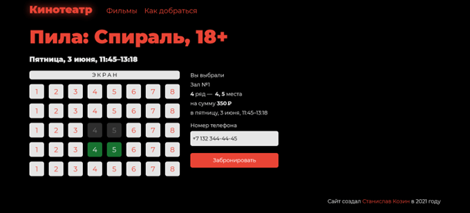

# cinema-frontend

Фронтенд сайта кинотеатра для курсовой работы по управлению разработкой информационных систем.

Написан на React. Сборка через Webpack.

[Репозиторий с бэкендом](https://github.com/staskozin/cinema-backend)

## Список фильмов

## Страница фильма

## Выбор мест

## Бронирование завершено

